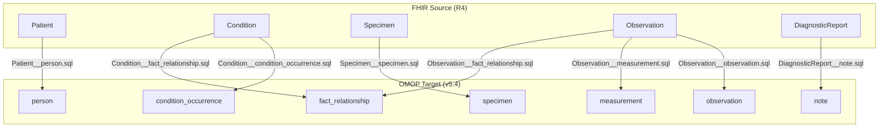
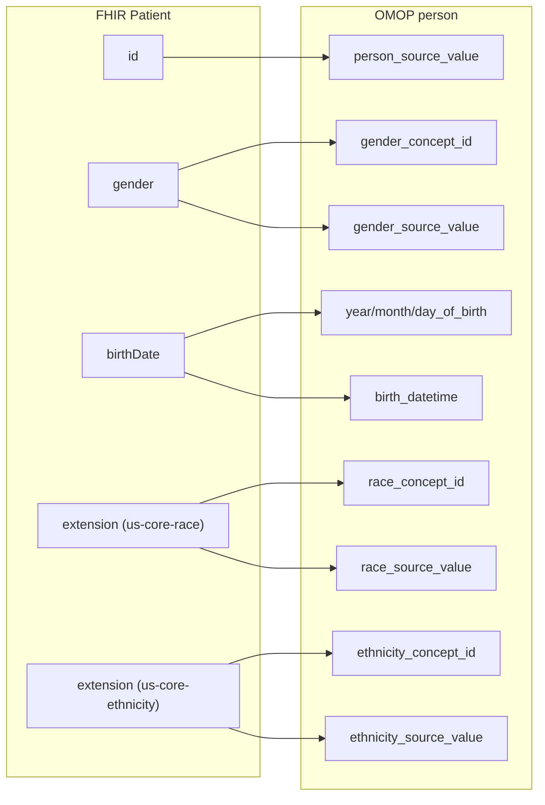
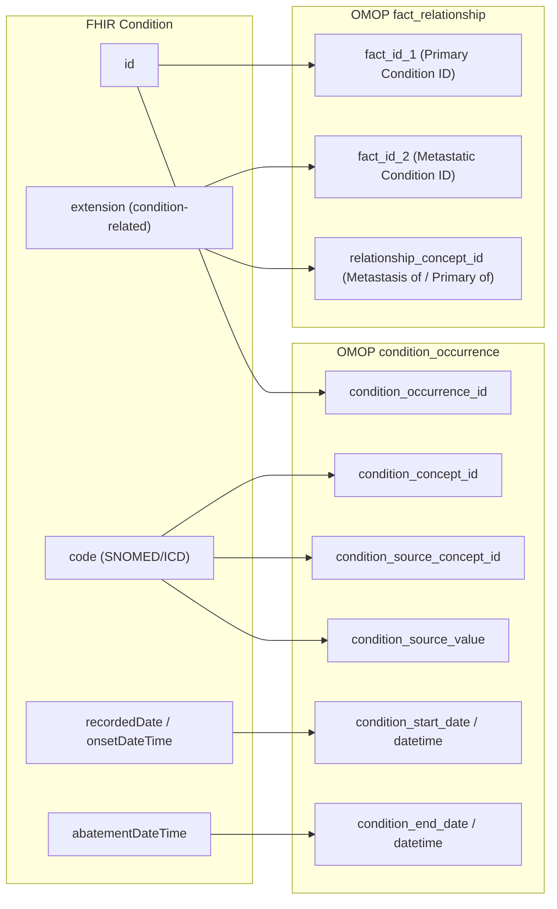
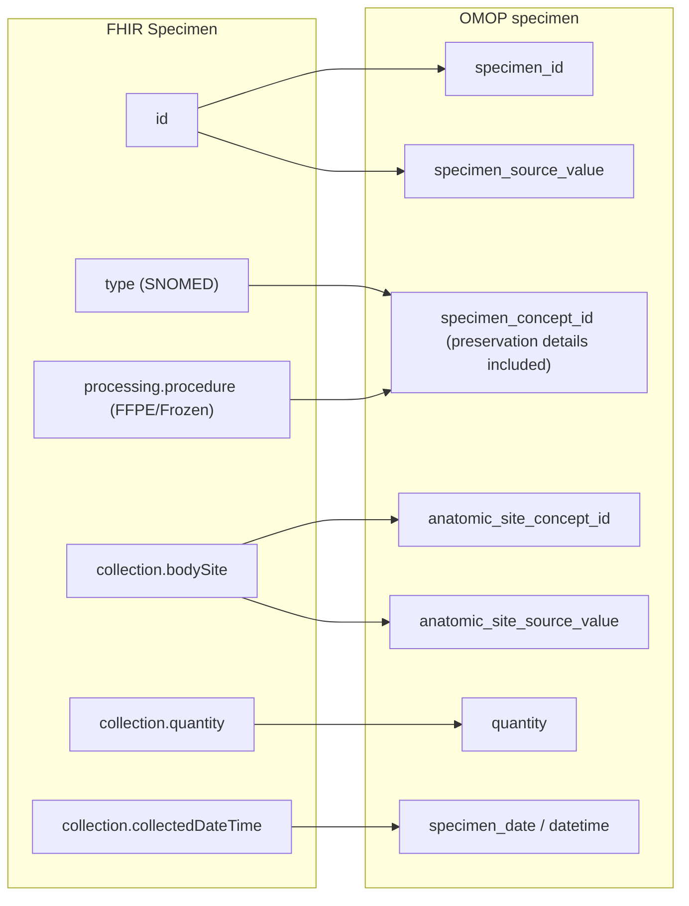
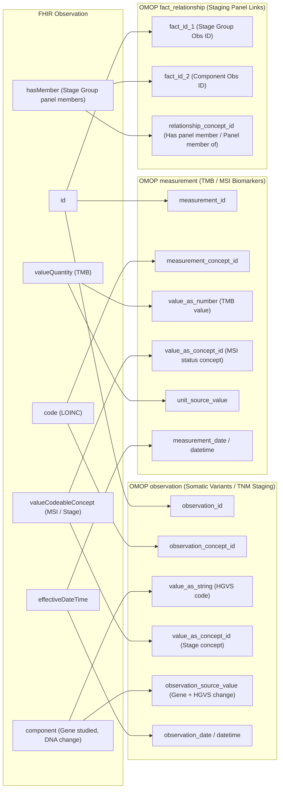
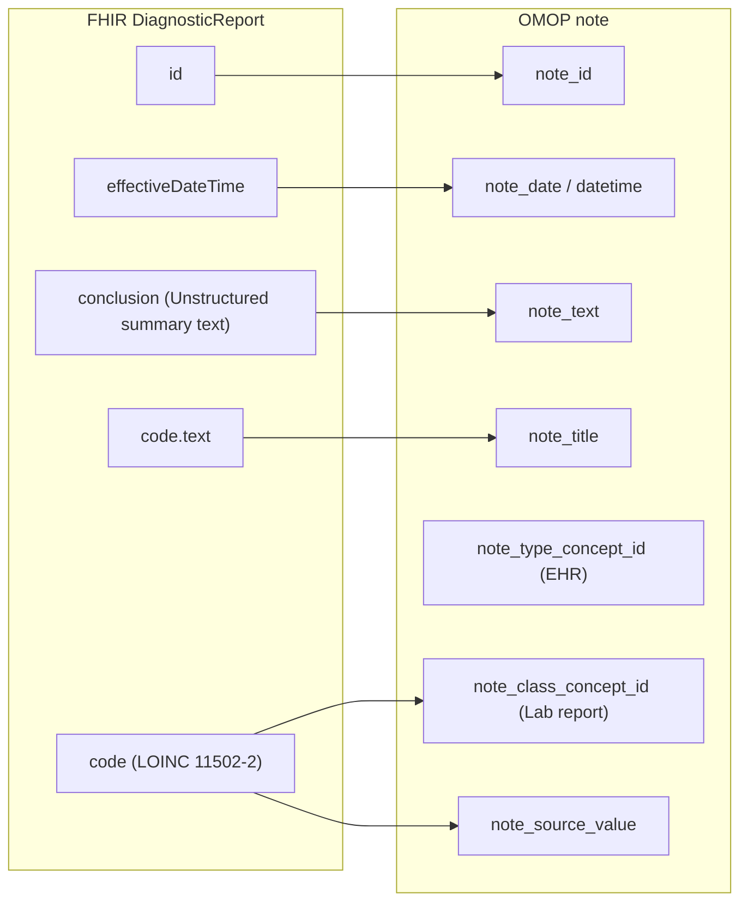

# Oncology NGS Biomarker Specialty Pack

This pack contains FHIR-to-OMOP mapping definitions and test specifications optimized for oncology datasets, Next-Generation Sequencing (NGS) reports, and tumor biopsy specimens.

## Mapping
 for the basic mapping of oncology diagnoses, genomic report text, and tumor specimens, you do not have to write new SQL-on-FHIR views or SQL ELT scripts.

These cases reuse the existing, core mapping pipelines:

- Oncology Diagnosis flows through the existing 
- Condition__condition_occurrence edge.
- Oncology NGS Reports flow through the existing 

DiagnosticReport__note
 edge.
Tumor Biopsy Details flow through the existing Specimen__specimen edge.

## Source-to-Target Mapping Logic

The following diagram illustrates the clinical data flow from FHIR R4 source resources to OMOP CDM v5.4 target tables:

---

## Scope & Target Models

The pack covers four main mapping aspects to represent cancer patient data in chronological order:

1. **Oncology Diagnosis (`condition--condition-occurrence--oncology-diagnosis.json`):**
   - **Clinical Simulation:** A patient diagnosed with primary lung cancer (adenocarcinoma of lung) and a secondary metastatic tumor in the brain.
   - **FHIR Input:** 
     - A primary `Condition` resource with the SNOMED code `254632001` ("Adenocarcinoma of lung"), status `active`, and verification status `confirmed`.
     - A secondary `Condition` resource with the SNOMED code `94225005` ("Secondary malignant neoplasm of brain"), carrying a `condition-related` extension referencing the primary diagnosis.
   - **OMOP Output:** 
     - One `condition_occurrence` row for the primary tumor mapped to standard concept `4115276` ("Adenocarcinoma of lung").
     - One `condition_occurrence` row for the brain metastasis mapped to standard concept `436659` ("Secondary malignant neoplasm of brain").
     - Two bidirectional `fact_relationship` rows with relationship concept IDs `44818854` ("Primary of") and `44818765` ("Metastasis of") linking the primary and secondary condition occurrences.
   - Maps cancer diagnoses (primary tumor site, histology, secondary metastatic sites) to the [OMOP CDM v5.4 condition_occurrence](https://ohdsi.github.io/CommonDataModel/cdm54.html#CONDITION_OCCURRENCE) and [fact_relationship](https://ohdsi.github.io/CommonDataModel/cdm54.html#FACT_RELATIONSHIP) tables.
   - Leverages ICD-O-3 and SNOMED-CT terminologies for tumor staging and grading.
   - Maps from [FHIR R4 Condition](https://hl7.org/fhir/R4/condition.html).
   - *Note: Shares the underlying pipeline and SQL logic defined in [`Condition__condition_occurrence.sql`](/mapspec/etl/Condition__condition_occurrence.sql) and [`Condition__fact_relationship.sql`](/mapspec/etl/Condition__fact_relationship.sql) with the core condition cases.*

2. **Tumor Biopsy Details (`specimen--specimen--oncology-tumor-biopsy.json`):**
   - **Clinical Simulation:** Biopsy specimens collected from patients for oncology genetic testing, representing both liquid biopsy (blood draw) and solid tumor tissue biopsies with preservation details.
   - **FHIR Input:** 
     - A liquid `Specimen` of type SNOMED `119297000` ("Blood specimen"), collection body site SNOMED `368208006` ("Left upper arm structure"), and quantity `10 mL`.
     - A solid tissue `Specimen` of type SNOMED `258435002` ("Tissue specimen"), collection body site SNOMED `361362002` ("Structure of left upper lobe of lung"), quantity `5 mg`, and FFPE preservation processing (procedure SNOMED `434643000`).
     - A solid tissue `Specimen` of type SNOMED `258435002` ("Tissue specimen"), collection body site SNOMED `361362002` ("Structure of left upper lobe of lung"), quantity `3 mg`, and Frozen preservation processing (procedure SNOMED `429215003`).
   - **OMOP Output:** 
     - Liquid biopsy: `specimen_concept_id` = `4001225` ("Blood specimen"), `anatomic_site_concept_id` = `4283159` ("Left upper arm structure"), quantity = `10`.
     - FFPE tissue: `specimen_concept_id` = `4264660` ("Formalin-fixed paraffin-embedded tissue specimen"), `anatomic_site_concept_id` = `4031641` ("Structure of left upper lobe of lung"), quantity = `5`.
     - Frozen tissue: `specimen_concept_id` = `4264661` ("Frozen tissue specimen"), `anatomic_site_concept_id` = `4031641` ("Structure of left upper lobe of lung"), quantity = `3`.
   - Maps biopsy collection methods, anatomical sites (primary vs. metastatic tissue), and sample preservation to the [OMOP CDM v5.4 specimen](https://ohdsi.github.io/CommonDataModel/cdm54.html#SPECIMEN) table.
   - Maps from [FHIR R4 Specimen](https://hl7.org/fhir/R4/specimen.html).
   - *Note: Shares the underlying pipeline and SQL logic defined in [`Specimen__specimen.sql`](/mapspec/etl/Specimen__specimen.sql) with the core specimen cases.*

3. **Genomics & Staging Panels (`observation--measurement--genomics-staging.json`):**
   - **Clinical Simulation:** Structured genomic findings (somatic variants, TMB, MSI) and TNM staging panel linkages for cancer patients.
   - **FHIR Input:**
     - An `Observation` carrying EGFR p.L858R somatic mutation details (LOINC `48018-6` variant panel with `48005-3` Gene Studied = `"EGFR"` and `48004-6` DNA Change = `"p.L858R"` components).
     - An `Observation` carrying TMB level of `12.5 mut/Mb` (LOINC `94076-7`).
     - An `Observation` carrying MSI-High status (LOINC `81695-9` valueCodeableConcept `LA26284-4` "High").
     - A Pathological TNM Stage Group `Observation` (LOINC `21908-9` value SNOMED `371607005` "Stage IIIA") linked via `hasMember` to Pathological T (LOINC `21905-5`), N (LOINC `21906-3`), and M (LOINC `21907-1`) category observations.
   - **OMOP Output:**
     - EGFR Variant: One `observation` row mapped to LOINC `3011961` with `value_as_string` = `"p.L858R"` and `observation_source_value` = `"EGFR p.L858R"`.
     - TMB & MSI: Mapped to the `measurement` table with concepts `3027815` (TMB, `value_as_number` = `12.5`) and `3016431` (MSI, `value_as_concept_id` = `45878583` "High").
     - Stage Group & TNM categories: Mapped to the `observation` table. Links between Stage Group and T, N, M categories mapped to `fact_relationship` (relationship concept IDs `44818790` "Has panel member" and `44818873` "Panel member of").
   - Maps from [FHIR R4 Observation](https://hl7.org/fhir/R4/observation.html).
   - *Note: Shares the underlying pipeline and SQL logic defined in [`Observation__observation.sql`](/mapspec/etl/Observation__observation.sql), [`Observation__measurement.sql`](/mapspec/etl/Observation__measurement.sql), and [`Observation__fact_relationship.sql`](/mapspec/etl/Observation__fact_relationship.sql).*

4. **Oncology NGS Reports (`diagnosticreport--note--oncology-ngs.json`):**
   - **Clinical Simulation:** Recording the text output of a Next-Generation Sequencing (NGS) genomic panel report.
   - **FHIR Input:** A [`DiagnosticReport`](https://build.fhir.org/ig/HL7/genomics-reporting/StructureDefinition-genomic-report.html) with [LOINC](https://hl7.org/fhir/R4/valueset-report-codes.html) [code `11502-2`](https://loinc.org/11502-2) ("Laboratory report") and a textual variant summary in the `conclusion` field (*"Positive for somatic variants: EGFR p.L858R mutation detected."*).
   - **OMOP Output:** One `note` row where `note_text` contains the report's text findings verbatim, `note_type_concept_id` is set to `32817` ("EHR"), and language is verified as English (`4180186`).
   - Maps clinical genomics and NGS reports (somatic variants, gene fusions, copy number variations, TMB/MSI status) into the [OMOP CDM v5.4 note](https://ohdsi.github.io/CommonDataModel/cdm54.html#NOTE) table for raw report storage.
   - Bridges structured genomic assertions into the `observation` and `measurement` tables.
   - Maps from [FHIR R4 DiagnosticReport](https://hl7.org/fhir/R4/diagnosticreport.html) based on the [HL7 Clinical Genomics Reporting IG](http://hl7.org/fhir/uv/genomics-reporting/).
   - *Note: Shares the underlying pipeline and SQL logic defined in [`DiagnosticReport__note.sql`](/mapspec/etl/DiagnosticReport__note.sql) with the core diagnosticreport note cases.*

---

## Detailed Entity-to-Table Field Mappings

Below are the detailed, field-level source-to-target mapping relationships for each clinical entity implemented in this specialty pack.

### 1. Patient Mapping (Demographics & Race/Ethnicity)

**Business Logic & Process Flow:**
* **Logic:** When a patient is registered, we must capture their demographic profile (birth date, gender, race, and ethnicity) to establish a base `person` record. Standardizing these demographics is crucial for building clinical cohorts and tracking patient characteristics.
* **Process Flow & Scripts:**
  1. **Stage-1 (Extraction):** The JSON view [`Patient__person.view.json`](/mapspec/views/Patient__person.view.json) extracts raw fields like birthDate and gender, and unrolls US Core race/ethnicity extensions from the FHIR `Patient` resource.
  2. **Stage-2 (Normalization & Loading):** The SQL script [`Patient__person.sql`](/mapspec/etl/Patient__person.sql) maps these raw fields into standard OMOP codes (e.g. converting `"female"` to code `8532` using `cm.gender_to_omop`, and checking standard OMB lists for race/ethnicity). It then writes the unified patient record to the target `person` table.

---

### 2. Condition Mapping (Oncology Diagnosis & Metastatic Site Linkage)

**Business Logic & Process Flow:**
* **Logic:** Diagnoses represent active diseases. In cancer care, distinguishing a primary tumor from metastatic spread and preserving the parent-child linkage between them is critical to trace disease progression and evaluate survival outcomes.
* **Process Flow & Scripts:**
  1. **Stage-1 (Extraction):** The JSON view [`Condition__condition_occurrence.view.json`](/mapspec/views/Condition__condition_occurrence.view.json) parses the FHIR `Condition` resource to extract diagnosis codings, onset dates, and references to related conditions (representing metastases linked to primary sites).
  2. **Stage-2 (Diagnosis Mapping):** The SQL script [`Condition__condition_occurrence.sql`](/mapspec/etl/Condition__condition_occurrence.sql) standardizes SNOMED-CT or ICD codes to standard concept IDs via `cm.fhir_system_to_omop_vocab` and records the diagnosis events in `condition_occurrence`.
  3. **Stage-2 (Metastasis Linking):** The SQL script [`Condition__fact_relationship.sql`](/mapspec/etl/Condition__fact_relationship.sql) matches metastatic records to their primary parent diagnoses via a self-join and writes bidirectional links (`Primary of` and `Metastasis of`) to the `fact_relationship` table.

---

### 3. Specimen Mapping (Tumor Biopsy & Sample Preservation)

**Business Logic & Process Flow:**
* **Logic:** Biopsy specimens (like solid tissue samples or liquid blood draws) are collected for pathology and molecular diagnostics. Recording preservation processing (like Formalin-Fixation Paraffin-Embedding vs. Freezing) and anatomical sites is essential to check sample viability and locate origin tissue.
* **Process Flow & Scripts:**
  1. **Stage-1 (Extraction):** The JSON view [`Specimen__specimen.view.json`](/mapspec/views/Specimen__specimen.view.json) extracts the specimen type, collection date, quantity, collection site, and processing procedures from the FHIR `Specimen` resource.
  2. **Stage-2 (Preservation & Site Mapping):** The SQL script [`Specimen__specimen.sql`](/mapspec/etl/Specimen__specimen.sql) checks the processing methods. If FFPE or Freezing is detected, it upgrades the generic specimen concept to a precise preservation-specific concept (e.g. `"Formalin-fixed paraffin-embedded tissue specimen"`). It also standardizes the anatomical site and loads the results into `specimen`.

---

### 4. Observation Mapping (Structured Genomic Findings & TNM Cancer Staging Panels)

**Business Logic & Process Flow:**
* **Logic:** Lab and genomic panel results carry distinct types of clinical assertions. Somatic variant detections (EGFR) and cancer stages represent diagnostic assertions (Observations), whereas quantitative biomarkers (like MSI-High status and TMB values) represent laboratory tests (Measurements). Staging group panels also contain sub-members (T, N, M categories) that must be linked to their parent group to preserve clinical context.
* **Process Flow & Scripts:**
  1. **Stage-1 (Extraction):** The JSON view [`Observation__measurement.view.json`](/mapspec/views/Observation__measurement.view.json) extracts codings, component keys (like Gene and DNA change), and lists of panel members (`hasMember`) from the FHIR `Observation` resource.
  2. **Stage-2 (Resolution):** The SQL helper [`_resolve_observation.sql`](/mapspec/etl/_resolve_observation.sql) joins coding systems to standard OMOP vocabularies using `cm.fhir_system_to_omop_vocab` and cleans component structures.
  3. **Stage-2 (Domain Routing):**
     * The SQL script [`Observation__observation.sql`](/mapspec/etl/Observation__observation.sql) filters observations belonging to the Observation domain (such as EGFR variant and TNM staging group/components) and writes them to `observation`.
     * The SQL script [`Observation__measurement.sql`](/mapspec/etl/Observation__measurement.sql) filters observations belonging to the Measurement domain (such as TMB levels and MSI status) and writes them to `measurement`.
  4. **Stage-2 (Panel Linkage):** The SQL script [`Observation__fact_relationship.sql`](/mapspec/etl/Observation__fact_relationship.sql) links TNM Stage Group rows to their respective T, N, and M components in `fact_relationship` using bidirectional relationship concepts (`Has panel member` and `Panel member of`).

---

### 5. DiagnosticReport Mapping (NGS Narrative Reports)

**Business Logic & Process Flow:**
* **Logic:** When a lab finishes sequencing, they release a narrative report summarizing their findings. Staging the full textual content of this document is crucial for auditing, clinical NLP search pipelines, and manual chart review.
* **Process Flow & Scripts:**
  1. **Stage-1 (Extraction):** The JSON view [`DiagnosticReport__note.view.json`](/mapspec/views/DiagnosticReport__note.view.json) extracts the report's conclusion summary, LOINC code, and release timestamp from the FHIR `DiagnosticReport` resource.
  2. **Stage-2 (Narrative Loading):** The SQL script [`DiagnosticReport__note.sql`](/mapspec/etl/DiagnosticReport__note.sql) formats the report text, resolves the note classification concepts, and inserts the full text record into `note`.

 
