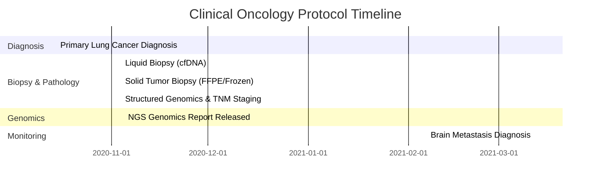

# Real-World Oncology Protocol: NGS Biomarker Testing

This document outlines the clinical protocol, best practices, and procedures for Next-Generation Sequencing (NGS) biomarker testing, modeled after the patient journey in the Oncology NGS Biomarker pack.

---

## 1. Patient Profile & Clinical History

* **Patient Profile:** Jane Doe, 50-year-old female
* **Baseline Risk:** No prior history of malignancy.
* **Presenting Symptoms:** Persistent cough and shortness of breath leading to clinical investigation.

---

## 2. Diagnostic & Treatment Timeline

The following timeline illustrates the standard clinical progression from initial diagnosis through genomic testing and longitudinal monitoring:

---

## 3. Protocol Stages and Best Practices

### Stage 1: Primary Diagnosis
**Clinical Procedure:**
Following the presentation of symptoms, the patient undergoes imaging (e.g., CT/PET scans) and an initial tissue biopsy to confirm the presence of malignancy. In this case, the diagnosis is confirmed as **Lung Adenocarcinoma** (SNOMED-CT `254632001`).

**Best Practices:**
* **Timely Documentation:** Ensure the primary diagnosis is accurately coded using standard ontologies (SNOMED/ICD-10) to facilitate automated registry reporting and cohort identification.
* **Multidisciplinary Tumor Board (MTB):** Discuss the confirmed primary diagnosis in an MTB to determine the optimal strategy for molecular profiling and systemic therapy.

### Stage 2: Specimen Collection & Preservation
**Clinical Procedure:**
To guide targeted therapy, a comprehensive genomic profiling protocol is initiated. This involves concurrent collection of different specimen types:
1. **Liquid Biopsy:** A blood draw (10 mL) to extract circulating cell-free DNA (cfDNA) (SNOMED-CT `119297000`).
2. **Solid Tissue Biopsy:** Extraction of tissue from the primary tumor site (Left upper lobe of lung). The tissue is divided for two distinct preservation workflows:
   * **FFPE (Formalin-Fixed Paraffin-Embedded):** 5 mg of tissue is fixed in formalin and embedded in paraffin (SNOMED-CT `434643000`). Used for histopathology and immunohistochemistry (IHC).
   * **Fresh Frozen:** 3 mg of tissue is rapidly frozen (SNOMED-CT `429215003`). Used for high-fidelity molecular diagnostics and RNA sequencing.

**Best Practices:**
* **Concurrent Sampling:** Collecting both liquid and solid biopsies on the same day ensures a comprehensive genomic snapshot, as cfDNA can capture tumor heterogeneity missed by a localized tissue punch.
* **Tissue Stewardship:** Optimizing the division of solid tumor tissue between FFPE (morphology) and Frozen (genomics) is critical when tissue cellularity is low.
* **Precise Anatomical Mapping:** Record the exact anatomical site of extraction (e.g., SNOMED-CT `361362002` Left upper lobe) to track spatial heterogeneity of the tumor over time.

### Stage 3: Next-Generation Sequencing (NGS) & Staging
**Clinical Procedure:**
The extracted cfDNA from the liquid biopsy (or DNA/RNA from the frozen solid tissue) undergoes NGS to identify actionable somatic mutations and clinical biomarkers. Concurrently, the pathologic cancer stage is determined.
1. **Somatic Variant Identifying:** The sequencing identifies a somatic **EGFR p.L858R mutation** (LOINC `48018-6` variant panel).
2. **Immunotherapy Biomarkers:** The laboratory measures Tumor Mutational Burden (TMB) at **12.5 mut/Mb** (LOINC `94076-7`) and Microsatellite Instability (MSI) status as **High** (LOINC `81695-9`).
3. **Cancer Staging:** Pathological staging establishes a **Stage IIIA** group (LOINC `21908-9`), comprised of T3 (LOINC `21905-5`), N1 (LOINC `21906-3`), and M0 (LOINC `21907-1`) staging categories.

**Best Practices:**
* **Standardized Reporting:** Genomic findings must be reported using standardized nomenclature (e.g., HGVS strings like `p.L858R` for sequence variants) and standard gene symbols (HUGO/HGNC).
* **Actionability Linkage:** The presence of the EGFR p.L858R mutation immediately qualifies the patient for targeted EGFR Tyrosine Kinase Inhibitors (TKI) such as Osimertinib. High TMB or MSI-High status guides potential treatment with immune checkpoint inhibitors (e.g., Pembrolizumab).
* **Panel-Member Association:** TNM staging categories must be linked directly to their parent Stage Group observation to preserve mCODE structural hierarchies.
* **Data Integration:** Capture raw unstructured reports (notes) alongside discrete, structured measurements (TMB, MSI) and staging observations to ensure semantic utility for downstream analytics.

### Stage 4: Longitudinal Monitoring & Metastasis Tracking
**Clinical Procedure:**
The patient is monitored longitudinally. Five months post-diagnosis, surveillance imaging reveals a secondary metastatic lesion in the brain (SNOMED-CT `94225005`).

**Best Practices:**
* **Explicit Linkage:** It is critical to explicitly link the secondary metastasis back to the primary tumor in the clinical data model (using "Metastasis of" relationships). This prevents the secondary tumor from being erroneously classified as a new primary cancer.
* **Re-biopsy Protocols:** Upon progression or metastasis, consider re-biopsying (often via liquid biopsy) to check for acquired resistance mutations (e.g., EGFR T790M) that would alter the targeted therapy regimen.

---

## 4. References & Clinical Guidelines
* [NCCN Guidelines for Non-Small Cell Lung Cancer (NSCLC)](https://www.nccn.org/guidelines/guidelines-detail?category=1&id=1450)
* [College of American Pathologists (CAP) Guidelines for Lung Cancer Biomarker Testing](https://www.cap.org/protocols-and-guidelines/cap-guidelines/current-cap-guidelines/lung-cancer-biomarker-testing-guideline)
* [OHDSI Oncology Working Group - Genomic Extension Model](https://ohdsi.github.io/Oncology/genomics.html)
