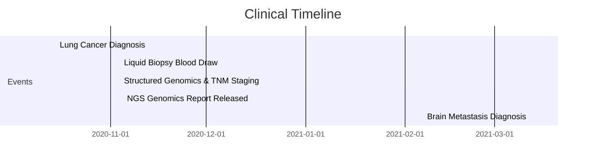

# Oncology NGS Biomarker Clinical Case Narrative

This document describes the clinical narrative (patient journey) representing the test cases in the Oncology NGS Biomarker pack.

---

## Patient Profile

* **Subject:** Jane Doe, 50-year-old female (Born August 20, 1975)
* **Clinical History:** No prior history of malignancy.

---

## Patient Journey & Mapped Events

### Event 1: Primary Diagnosis (October 15, 2020) & Brain Metastasis (March 12, 2021)
* **Clinical Scenario:** The patient presents with a persistent cough and shortness of breath. Imaging and biopsy confirm lung adenocarcinoma (primary tumor). Months later, a brain scan reveals a secondary metastatic lesion (secondary tumor).
* **Mapped FHIR Resources:** [`Condition/onc-cond-2` and `Condition/onc-cond-3`](/cases/condition--condition-occurrence--oncology-diagnosis.json)
  * Primary: SNOMED-CT `254632001` (*Adenocarcinoma of lung*)
  * Metastasis: SNOMED-CT `94225005` (*Secondary malignant neoplasm of brain*) with `condition-related` extension pointing back to the lung adenocarcinoma.
* **OMOP Target representation:** 
  * Two `condition_occurrence` rows mapping the diagnoses standardly to concepts `4115276` (*Adenocarcinoma of lung*) and `436659` (*Secondary malignant neoplasm of brain*).
  * Two bidirectional `fact_relationship` rows with relationship concept IDs `44818854` ("Primary of") and `44818765` ("Metastasis of") linking the two condition occurrences.

### Event 2: Tumor Specimen Collection & Preservation (November 4, 2020)
* **Clinical Scenario:** To guide targeted therapy, the clinical team orders genomic sequencing. The protocol requires collecting both cell-free DNA via a liquid biopsy (blood draw) and a solid tissue biopsy of the primary lung tumor (left upper lobe). The solid tumor tissue is divided: one portion is preserved using Formalin-Fixation Paraffin-Embedding (FFPE) for histopathology and immunohistochemistry, while another portion is Fresh Frozen for molecular diagnostics.
* **Mapped FHIR Resources:** [`Specimen/onc-spec-1`, `Specimen/onc-spec-2`, and `Specimen/onc-spec-3`](/cases/specimen--specimen--oncology-tumor-biopsy.json)
  1. **Liquid Biopsy:**
     - Type: SNOMED-CT `119297000` (*Blood specimen*)
     - Site: SNOMED-CT `368208006` (*Left upper arm structure*)
     - Quantity: `10 mL`
     - Mapped to: `specimen_concept_id` = `4001225` (*Blood specimen*), `anatomic_site_concept_id` = `4283159` (*Left upper arm structure*), `quantity` = `10`.
  2. **Solid Biopsy (FFPE):**
     - Type: SNOMED-CT `258435002` (*Tissue specimen*)
     - Site: SNOMED-CT `361362002` (*Structure of left upper lobe of lung*)
     - Quantity: `5 mg`
     - Processing: SNOMED-CT `434643000` (*Formalin fixed paraffin embedded sectioning*)
     - Mapped to: `specimen_concept_id` = `4264660` (*Formalin-fixed paraffin-embedded tissue specimen*), `anatomic_site_concept_id` = `4031641` (*Structure of left upper lobe of lung*), `quantity` = `5`.
  3. **Solid Biopsy (Frozen):**
     - Type: SNOMED-CT `258435002` (*Tissue specimen*)
     - Site: SNOMED-CT `361362002` (*Structure of left upper lobe of lung*)
     - Quantity: `3 mg`
     - Processing: SNOMED-CT `429215003` (*Freezing*)
     - Mapped to: `specimen_concept_id` = `4264661` (*Frozen tissue specimen*), `anatomic_site_concept_id` = `4031641` (*Structure of left upper lobe of lung*), `quantity` = `3`.

### Event 3: NGS Genomic Report Release (November 5, 2020)
* **Clinical Scenario:** Next-Generation Sequencing (NGS) is performed on the cell-free DNA (cfDNA) extracted from the blood specimen. The genomic laboratory releases the final diagnostic report, showing somatic mutation positive for the `EGFR p.L858R` mutation.
* **Mapped FHIR Resource:** [`DiagnosticReport/onc-dr-1`](/cases/diagnosticreport--note--oncology-ngs.json)
  * Code: LOINC `11502-2` (*Laboratory report*)
  * Findings (Conclusion text): *"Positive for somatic variants: EGFR p.L858R mutation detected."*
* **OMOP Target representation:** `note` row storing the raw report findings verbatim in the `note_text` field for clinical NLP pipelines.

### Event 4: Structured Genomic Findings & TNM Cancer Staging Panels (November 4, 2020)
* **Clinical Scenario:** Alongside the raw report text, the clinical database extracts and records structured genomics assertions and mCODE staging parameters as individual observation entries:
  1. **EGFR Variant:** A structured observation representing the `EGFR p.L858R` somatic mutation.
  2. **Biomarkers:** Quantitative findings for Tumor Mutational Burden (TMB) and Microsatellite Instability (MSI).
  3. **TNM Staging:** A pathological cancer Stage Group panel containing pathological T, N, and M components.
* **Mapped FHIR Resources:** [`Observation/onc-obs-variant-1`, `Observation/onc-obs-tmb-1`, `Observation/onc-obs-msi-1`, `Observation/onc-obs-stage-group-1`, `Observation/onc-obs-stage-t-1`, `Observation/onc-obs-stage-n-1`, and `Observation/onc-obs-stage-m-1`](/cases/observation--measurement--genomics-staging.json)
  * EGFR Observation: Mapped to standard concept `3011961` (*Gene variant analysis*) with `value_as_string` = `"p.L858R"` and `observation_source_value` = `"EGFR p.L858R"`.
  * TMB & MSI: Mapped to the `measurement` table with concepts `3027815` (TMB, `value_as_number` = `12.5`) and `3016431` (MSI, `value_as_concept_id` = `45878583` "High").
  * Stage Group & Categories: Mapped to the `observation` table. Links between Stage Group and T, N, M categories mapped to `fact_relationship` (relationship concept IDs `44818790` "Has panel member" and `44818873` "Panel member of").

