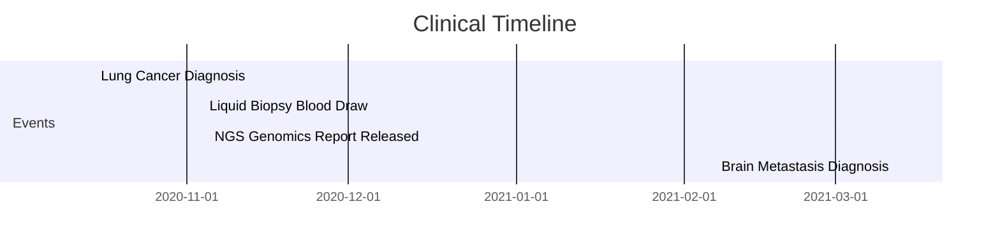

# Oncology NGS Biomarker Clinical Case Narrative

This document describes the clinical narrative (patient journey) representing the test cases in the Oncology NGS Biomarker pack.

---

## Patient Profile

* **Subject:** Jane Doe, 50-year-old female (Born August 20, 1975)
* **Clinical History:** No prior history of malignancy.

---

## Patient Journey & Mapped Events

### Event 1: Primary Diagnosis (October 15, 2020) & Brain Metastasis (March 12, 2021)
* **Clinical Scenario:** The patient presents with a persistent cough and shortness of breath. Imaging and biopsy confirm lung adenocarcinoma (primary tumor). Months later, a brain scan reveals a secondary metastatic lesion (secondary tumor).
* **Mapped FHIR Resources:** [`Condition/onc-cond-2` and `Condition/onc-cond-3`](/cases/condition--condition-occurrence--oncology-diagnosis.json)
  * Primary: SNOMED-CT `254632001` (*Adenocarcinoma of lung*)
  * Metastasis: SNOMED-CT `94225005` (*Secondary malignant neoplasm of brain*) with `condition-related` extension pointing back to the lung adenocarcinoma.
* **OMOP Target representation:** 
  * Two `condition_occurrence` rows mapping the diagnoses standardly to concepts `4115276` (*Adenocarcinoma of lung*) and `436659` (*Secondary malignant neoplasm of brain*).
  * Two bidirectional `fact_relationship` rows with relationship concept IDs `44818854` ("Primary of") and `44818765` ("Metastasis of") linking the two condition occurrences.

### Event 2: Tumor Specimen Collection (November 4, 2020)
* **Clinical Scenario:** To guide targeted therapy, the clinical team orders genomic sequencing. A liquid biopsy blood draw is performed at the hospital's outpatient lab.
* **Mapped FHIR Resource:** [`Specimen/onc-spec-1`](/cases/specimen--specimen--oncology-tumor-biopsy.json)
  * Type: SNOMED-CT `119297000` (*Blood specimen*)
  * Site: SNOMED-CT `368208006` (*Left upper arm structure*)
  * Quantity: `10 mL`
* **OMOP Target representation:** `specimen` row mapping the blood draw to standard concept `4001225` (*Blood specimen*) and collection site to `4283159` (*Left upper arm structure*).

### Event 3: NGS Genomic Report Release (November 5, 2020)
* **Clinical Scenario:** Next-Generation Sequencing (NGS) is performed on the cell-free DNA (cfDNA) extracted from the blood specimen. The genomic laboratory releases the final diagnostic report, showing somatic mutation positive for the `EGFR p.L858R` mutation.
* **Mapped FHIR Resource:** [`DiagnosticReport/onc-dr-1`](/cases/diagnosticreport--note--oncology-ngs.json)
  * Code: LOINC `11502-2` (*Laboratory report*)
  * Findings (Conclusion text): *"Positive for somatic variants: EGFR p.L858R mutation detected."*
* **OMOP Target representation:** `note` row storing the raw report findings verbatim in the `note_text` field for clinical NLP pipelines.
